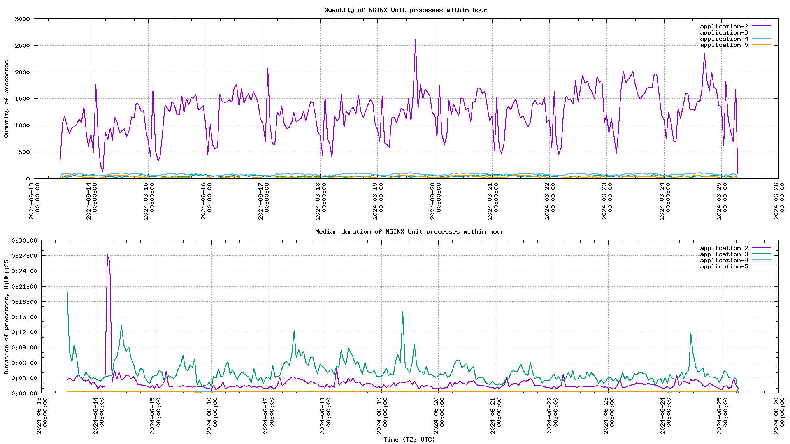

# NGINX Unit log analyzer



[](https://packagist.org/packages/andrey-tech/nginx-unit-log-analyzer-php)
[](https://packagist.org/packages/andrey-tech/nginx-unit-log-analyzer-php)
[](https://packagist.org/packages/andrey-tech/nginx-unit-log-analyzer-php)

NGINX Unit log analyzer — это утилита для анализа лог-файлов сервера приложений [NGINX Unit](https://unit.nginx.org/).  
Утилита анализирует продолжительность исполнения процессов NGINX Unit для запущенных приложений с точностью в одну секунду
и формирует в консоли отчёты различных типов в табличной или графической форме.

## Содержание

<!-- MarkdownTOC levels="1,2,3,4,5,6" autoanchor="true" autolink="true" -->

- [Установка](#%D0%A3%D1%81%D1%82%D0%B0%D0%BD%D0%BE%D0%B2%D0%BA%D0%B0)
- [Аргументы и опции командной строки](#%D0%90%D1%80%D0%B3%D1%83%D0%BC%D0%B5%D0%BD%D1%82%D1%8B-%D0%B8-%D0%BE%D0%BF%D1%86%D0%B8%D0%B8-%D0%BA%D0%BE%D0%BC%D0%B0%D0%BD%D0%B4%D0%BD%D0%BE%D0%B9-%D1%81%D1%82%D1%80%D0%BE%D0%BA%D0%B8)
    - [Опции командной строки](#%D0%9E%D0%BF%D1%86%D0%B8%D0%B8-%D0%BA%D0%BE%D0%BC%D0%B0%D0%BD%D0%B4%D0%BD%D0%BE%D0%B9-%D1%81%D1%82%D1%80%D0%BE%D0%BA%D0%B8)
- [Типы формируемых отчётов](#%D0%A2%D0%B8%D0%BF%D1%8B-%D1%84%D0%BE%D1%80%D0%BC%D0%B8%D1%80%D1%83%D0%B5%D0%BC%D1%8B%D1%85-%D0%BE%D1%82%D1%87%D1%91%D1%82%D0%BE%D0%B2)
    - [Отчёт типа `day`](#%D0%9E%D1%82%D1%87%D1%91%D1%82-%D1%82%D0%B8%D0%BF%D0%B0-day)
    - [Отчёт типа `top`](#%D0%9E%D1%82%D1%87%D1%91%D1%82-%D1%82%D0%B8%D0%BF%D0%B0-top)
    - [Отчёт типа `graph`](#%D0%9E%D1%82%D1%87%D1%91%D1%82-%D1%82%D0%B8%D0%BF%D0%B0-graph)
- [Авторы](#%D0%90%D0%B2%D1%82%D0%BE%D1%80%D1%8B)
- [Лицензия](#%D0%9B%D0%B8%D1%86%D0%B5%D0%BD%D0%B7%D0%B8%D1%8F)

<!-- /MarkdownTOC -->

<a id="%D0%A3%D1%81%D1%82%D0%B0%D0%BD%D0%BE%D0%B2%D0%BA%D0%B0"></a>
## Установка

NGINX Unit log analyzer требует:
 * [PHP](https://www.php.net/) версии не ниже 8.1;
 * [Composer](https://getcomposer.org/);
 * [GNU Plot](http://www.gnuplot.info/) версии не ниже 5.4. 

```shell
composer require --dev andrey-tech/nginx-unit-log-analyzer-php
```

Установка GNU Plot с помощью [APT (Advanced Package Tool)](https://en.wikipedia.org/wiki/APT_(software)):
```shell
apt install gnuplot
````

<a id="%D0%90%D1%80%D0%B3%D1%83%D0%BC%D0%B5%D0%BD%D1%82%D1%8B-%D0%B8-%D0%BE%D0%BF%D1%86%D0%B8%D0%B8-%D0%BA%D0%BE%D0%BC%D0%B0%D0%BD%D0%B4%D0%BD%D0%BE%D0%B9-%D1%81%D1%82%D1%80%D0%BE%D0%BA%D0%B8"></a>
## Аргументы и опции командной строки

```shell
./vendor/bin/nginx-unit-log-analyzer <NGINX Unit log file> [OPTIONS]
```
где:

* `[OPTIONS]` — опции командной строки,
* `<NGINX Unit log file>` — путь к лог-файлу NGINX Unit, содержащему информацию о запущенных процессах приложений вида:
 

```log
2024/06/13 13:31:06 [info] 657#657 "application-3" application started
2024/06/13 13:32:14 [notice] 151#151 app process 657 exited with code 0
```

<a id="%D0%9E%D0%BF%D1%86%D0%B8%D0%B8-%D0%BA%D0%BE%D0%BC%D0%B0%D0%BD%D0%B4%D0%BD%D0%BE%D0%B9-%D1%81%D1%82%D1%80%D0%BE%D0%BA%D0%B8"></a>
### Опции командной строки

| Опция                       | Описание                                   | Значение                                              | По умолчанию                  | Пример использования                               |
|-----------------------------|--------------------------------------------|-------------------------------------------------------|-------------------------------|----------------------------------------------------|
| `--log-timezone`            | Часовой пояс лог-файла                     | Имя часового пояса                                    | Часовой пояс скрипта          | `--log-timezone Europe/Moscow`                     |
| `--report-type`             | Тип формируемого отчёта                    | `day`, `top`, `graph`                                 | `graph`                       | `--report-type day`                                |
| `--report-timezone`         | Часовой пояс отчёта                        | Имя часового пояса                                    | Часовой пояс скрипта          | `--report-timezone Europe/Moscow`                  |
| `--filter-start-time-from`  | Фильтр записей лога по времени, от         | Строка даты и времени                                 | —                             | `--filter-start-time-from 2024-06-17 00:00:00 UTC` |
| `--filter-start-time-to`    | Фильтр записей лога по времени, до         | Строка даты и времени                                 | —                             | `--filter-start-time-to 2024-06-17 23:59:59 UTC`   |
| `--filter-application-name` | Фильтр записей лога по приложению          | Имя приложения                                        | —                             | `--filter-application-name application-1`          |
| `--graph-file-name`         | Имя файла графиков для отчёта типа `graph` | Имя файла                                             | `nginx-unit-log-analyzer.png` | `--graph-file-name unit.png`                       |
| `--graph-types`             | Типы графиков для отчёта `graph`           | `quantity`, `median`, `average`, `maximal`, `minimal` | `quantity` и `median`         | `--graph-types quantity --graph-types average`     |
| `--no-color`                | Отключение цветов в консоли                | —                                                     | —                             | `--no-color`                                       |

<a id="%D0%A2%D0%B8%D0%BF%D1%8B-%D1%84%D0%BE%D1%80%D0%BC%D0%B8%D1%80%D1%83%D0%B5%D0%BC%D1%8B%D1%85-%D0%BE%D1%82%D1%87%D1%91%D1%82%D0%BE%D0%B2"></a>
## Типы формируемых отчётов

Утилита NGINX Unit log analyzer может формировать отчёты трех типов (`--report-type`):

1. `day` — продолжительность исполнения процессов NGINX Unit для запущенных приложений с усреднением за один час и разбиением по дням;    
2. `top` — топ-лист наиболее и наименее продолжительных процессов NGINX Unit для запущенных приложений с разбиением по дням;
3. `graph` (по умолчанию) — графики продолжительности исполнения процессов NGINX Unit для запущенных приложений с усреднением за один час. 

Отчёты типа `day` и `top` формируется в консоли в табличной форме.

Отчёт типа `graph` формируется в графическом файле формата [PNG](https://en.wikipedia.org/wiki/PNG) 
и **требует** для своего создания утилиту [GNU Plot](http://www.gnuplot.info/).

Отчёт типа `graph` может включать следующие виды графиков (`--graph-types`):

* `quantity` (по умолчанию) — график количества процессов NGINX Unit для запущенных приложений с усреднением за один час; 
* `median` (по умолчанию) — график [медианной](https://en.wikipedia.org/wiki/Median) продолжительности исполнения процессов NGINX Unit для запущенных приложений с усреднением за один час;
* `average` — график [среднеарифметической](https://en.wikipedia.org/wiki/Arithmetic_mean) продолжительности исполнения процессов NGINX Unit для запущенных приложений с усреднением за один час; 
* `maximal` — график максимальной продолжительности исполнения процессов NGINX Unit для запущенных приложений с усреднением за один час; 
* `minimal` — график минимальной продолжительности исполнения процессов NGINX Unit для запущенных приложений с усреднением за один час.

<a id="%D0%9E%D1%82%D1%87%D1%91%D1%82-%D1%82%D0%B8%D0%BF%D0%B0-day"></a>
### Отчёт типа `day`

Пример фрагмента отчёта типа `day` для одного дня:


В таблице отчёта:

* `DATE` — анализируемая дата с указанием часового пояса;
* `APP` — список имён приложений, которые были запущены за анализируемую дату;
* `Processes` — информация о запущенных процессах NGINX Unit: 
  - `Start` — анализируемый интервал времени, часы (от-до);
  - `Amount` — количество процессов, которые были запущены в течение интервала времени;
* `Duration` — информация о продолжительности исполнения процессов в течение временного интервала:
  - `Median` — [медианное](https://en.wikipedia.org/wiki/Median) значение;
  - `Average` — [среднеарифметическое](https://en.wikipedia.org/wiki/Arithmetic_mean) значение;
  - `Std dev` — [среднеквадратическое отклонение](https://en.wikipedia.org/wiki/Standard_deviation) продолжительности;
  - `Min` — минимальное значение;
  - `Max` — максимальное значение.

Формат значений продолжительности исполнения процессов NGINX Unit в таблице имеет вид:  
`d h m s`, где: `d` — дни, `h` — часы, `m` — минуты, `s` — секунды.
 
<a id="%D0%9E%D1%82%D1%87%D1%91%D1%82-%D1%82%D0%B8%D0%BF%D0%B0-top"></a>
### Отчёт типа `top`

Пример фрагмента отчёта типа `top` для одного дня:


В таблице отчёта:

* `DATE` — анализируемая дата с указанием часового пояса;
* `APP` — список имён приложений, которые были запущены за анализируемую дату;
* `Duration` — продолжительность исполнения процесса;
* `App name` — имя приложения; 
* `Start time` — дата и время запуска процесса;
* `Exit time` — дата и время завершения процесса;
* `Start` — номер строки в лог-файле NGINX Unit, в которой был зафиксирован запуск процесса;
* `End` — номер строки в лог-файле NGINX Unit, в которой было зафиксировано завершение процесса;
* `Id` — [идентификатор процесса](https://en.wikipedia.org/wiki/Process_identifier) в NGINХ Unit.
  
В верхней части таблицы содержится список из 20 наиболее продолжительных процессов,
которые были зафиксированы за анализируемую дату.

В нижней части таблицы содержится список из 5 наименее продолжительных процессов,
которые были зафиксированы за анализируемую дату.

Списки отсортированы по убыванию продолжительности.

<a id="%D0%9E%D1%82%D1%87%D1%91%D1%82-%D1%82%D0%B8%D0%BF%D0%B0-graph"></a>
### Отчёт типа `graph`

Пример отчёта типа `graph`, включающий 2 графика: 

* график количества процессов NGINX Unit для запущенных приложений с усреднением за один час; 
* график [медианной](https://en.wikipedia.org/wiki/Median) продолжительности исполнения процессов.


Формат значений продолжительности исполнения процессов NGINX Unit на графике имеет вид:  
`H:MM:SS`, где: `H` — часы, `MM` — минуты, `SS` — секунды.

<a id="%D0%90%D0%B2%D1%82%D0%BE%D1%80%D1%8B"></a>
## Авторы

© 2024 andrey-tech

<a id="%D0%9B%D0%B8%D1%86%D0%B5%D0%BD%D0%B7%D0%B8%D1%8F"></a>
## Лицензия

Данная библиотека распространяется на условиях лицензии [MIT](./LICENSE).
